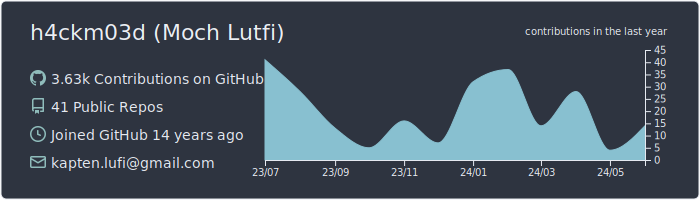

# :sparkling_heart: Contributions

Isometric view of contributions in the last year. Languages pie is based on recent commits

# :pencil2: Latest Blog Posts

<!-- BLOG-POST-LIST:START -->
- [kthSmallestInBST](https://lumochift.org/blog/dsa/tree/kthSmallestInBST)
- [Single linked list palindrome](https://lumochift.org/blog/dsa/linked-list/palindrome)
- [Remove Element from the single linked list](https://lumochift.org/blog/dsa/linked-list/remove-element-k)
- [Check 2 strings are following patterns](https://lumochift.org/blog/dsa/hash/follow-pattern)
- [Median of Two Sorted Arrays](https://lumochift.org/blog/cp/median-of-2-sorted-array)
- [Check symmetric binary tree](https://lumochift.org/blog/dsa/tree/mirrorred-binary-tree)
- [Custom JSON marshal/unmarshal](https://lumochift.org/blog/practical-go/custom-json-marshaller)
- [Rotate Matrix](https://lumochift.org/blog/cp/rotate-matrix)
- [Custom Tree Traversal](https://lumochift.org/blog/dsa/tree/tree-traversal)
- [Calculating the Sum of Squares of Integers in Go](https://lumochift.org/blog/cp/loopwithoutfor)
- [XSS - Cross Site Scripting Vulnerability](https://lumochift.org/blog/security/xss)
- [Leetcode biweekly contest 96](https://lumochift.org/blog/cp/biweekly-contest-96)
- [Rate limiter in Go](https://lumochift.org/blog/ratelimit)
- [TOTP based on RFC 6238](https://lumochift.org/blog/totp)
- [Practical Go: Functional Options Pattern](https://lumochift.org/blog/practical-go/functional-option-pattern)
- [Minesweeper](https://lumochift.org/blog/cp/minesweeper)
- [Artificial Neural Network](https://lumochift.org/blog/math-ann)
- [What company you must choose ?](https://lumochift.org/blog/career/whatcompany)
- [Palindrome Rearrange](https://lumochift.org/blog/cp/palindromeRearrange)
- [Iterate digit by given integer](https://lumochift.org/blog/cp/iterateNumber)
<!-- BLOG-POST-LIST:END -->

# :dizzy: Metrics and Statistics

