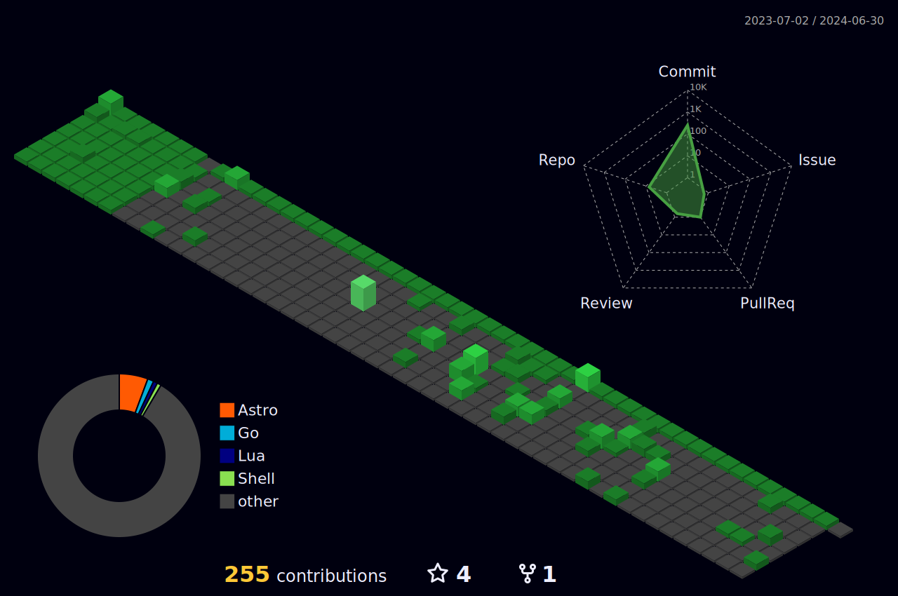

# :sparkling_heart: Contributions

Isometric view of contributions in the last year. Languages pie is based on recent commits

# :pencil2: Latest Blog Posts

<!-- BLOG-POST-LIST:START -->
- [Reverse In Parentheses](https://lumochift.org/blog/cp/reverseInParentheses)
- [Palindrome string](https://lumochift.org/blog/cp/palindrome)
- [Buffered vs non buffered file IO using go](https://lumochift.org/blog/showdown-go/fileio-comparison)
- [Data Structure: Tree](https://lumochift.org/blog/dsa/tree)
- [Practical Go: Dockerize go apps](https://lumochift.org/blog/practical-go/dockerize-go-app)
- [Go S.O.L.I.D: The Single Responsibility Principle](https://lumochift.org/blog/go-solid)
- [Coding Practice: Minimum Number of Arrows to Burst Balloons](https://lumochift.org/blog/cp/cp-leetcode-452)
- [Coding Practice: Word Search](https://lumochift.org/blog/cp/cp-word-search)
- [pg_stat_statements in action](https://lumochift.org/blog/pg-statement-in-action)
- [Prefer precise string types](https://lumochift.org/blog/prefer-precise-string-types)
- [Golang SQL Database](https://lumochift.org/blog/golang-koneksi-database)
- [Binary Operator Hack and Tricks](https://lumochift.org/blog/binary-operator)
- [Membuat Benchmark di Golang](https://lumochift.org/blog/golang-benchmark)
- [Tips dan trik unit test di Go](https://lumochift.org/blog/tips-trik-unit-test-golang)
- [Golang Test Coverage](https://lumochift.org/blog/golang-test-coverage)
- [Golang Om Telolet Om Server](https://lumochift.org/blog/golang-om-telolet-om-server)
- [Golang Unit Test](https://lumochift.org/blog/golang-unit-test)
- [Struct](https://lumochift.org/blog/struct)
- [Pointer](https://lumochift.org/blog/pointer)
- [Computer Science for Humanities](https://lumochift.org/blog/computer-science-for-humanities)
<!-- BLOG-POST-LIST:END -->

# :dizzy: Metrics and Statistics

