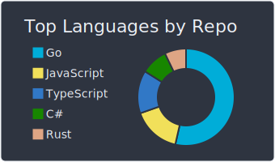
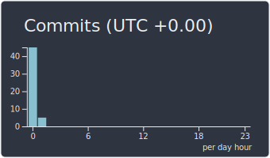

# :sparkling_heart: Contributions

Isometric view of contributions in the last year. Languages pie is based on recent commits

# :pencil2: Latest Blog Posts

<!-- BLOG-POST-LIST:START -->
- [Practical Go: Learn about return interface](/blog/return-interface)
- [Husky for Go: Guard your commit against the bad codes](/blog/commit-guardian)
- [Getting Started with Colima](/blog/colima-in-action)
- [Colima - container runtimes on macOS &lpar;and Linux&rpar;](/blog/colima-intro)
- [Book Review: Working in Public: The Making and Maintenance of Open Source Software by Nadia Eghbal](/blog/build-in-public)
- [Stateless Server: The Benefits of Storing Data Outside of the Server](/blog/stateless-server)
- [Understanding Different Authentication Methods: Password, Session, Cookie, Token, JWT, SSO, and OAuth](/blog/understanding-auth)
- [Building a Rule Engine for a Loyalty Program in Golang](/blog/simple-rule-engine)
- [The Power of People: Why Building Relationships is Crucial for Your Career](/blog/the-people-power)
- [The Blank Identifier in Go: A Swiss Army Knife for the Discerning Developer](/blog/blank-identifier)
<!-- BLOG-POST-LIST:END -->

# :dizzy: Metrics and Statistics

