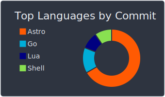

# :sparkling_heart: Contributions

Isometric view of contributions in the last year. Languages pie is based on recent commits

# :pencil2: Latest Blog Posts

<!-- BLOG-POST-LIST:START -->
- [Puzzle: Solve a cryptarithm problem with Go](/blog/is-crypt-solution)
- [Kubernetes Resource Requests and Limits](/blog/resource-requests-and-limits)
- [Why a Strong Work Ethic Matters in Hiring Engineers](/blog/strong-ethics)
- [An Introduction to Go Modules](/blog/intro-module)
- [Installing ArgoCD on k3s](/blog/k3s-argocd)
- [Introduction Profiling http server in go](/blog/profiling-server)
- [Practical Go: Using return pointer or not?](/blog/pointer-or-not)
- [How to check if a type satisfies an interface at runtime in Go](/blog/check-satisfy-interface)
- [XID: The GUID Alternative](/blog/xid-the-guid-alternative)
- [Auto Scaling](/blog/autoscaling)
- [Unit Testing in Golang](/blog/practical-unit-test)
- [Contains duplicate Problem](/blog/containsDuplicateWithRust)
- [Slice vs Array](/blog/slice)
- [Build Directed Graph](/blog/intro-graph)
- [Sudoku checker](/blog/sudoku-checker)
- [Implementing a Priority Queue Using Heap in Go](/blog/priority-queue)
- [Introduction of generic in Golang](/blog/intro-generic)
- [Understanding Stack and Heap Memory in Go](/blog/stack-heap)
- [Soft Skills for Software Engineers](/blog/softskill-swe)
- [Snowflake](/blog/snowflake)
<!-- BLOG-POST-LIST:END -->

# :dizzy: Metrics and Statistics

